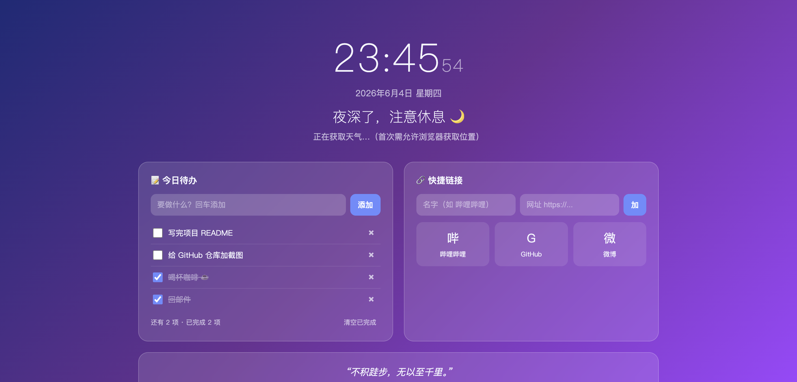

# 🪟 个人仪表盘 Personal Dashboard

一个好看的「新标签页」主页：时钟、问候语、实时天气、待办清单、快捷链接、每日一言。
纯前端、零依赖、双击即用，所有数据都存在你自己的浏览器里。

## ✨ 功能

- 🕐 **实时时钟 + 日期**，按时间段自动切换问候语
- 🌤 **实时天气**（用免费的 [Open-Meteo](https://open-meteo.com/)，无需注册密钥，需授权浏览器定位，本地缓存 30 分钟）
- 📝 **待办清单**：添加 / 勾选 / 删除 / **双击编辑** / **一键清空已完成**，带进度统计，自动保存
- 🔗 **快捷链接**：自定义常用网站，一键直达
- 💬 **每日一言**：每天换一句，离线也能用

## 🚀 使用

直接双击 `index.html` 用浏览器打开即可。第一次会问你是否允许获取位置（用于显示天气），允许后就能看到当地天气；不允许也不影响其他功能。

## 🛠 技术说明（给好奇的你）

- 纯 HTML + CSS + JavaScript，没有用任何框架，方便阅读和修改。
- 数据保存在浏览器的 `localStorage`（本地存储）里，关掉网页也不会丢，且不会上传到任何服务器。
- 想换背景颜色？改 `<style>` 里 `body` 的 `background`。想改问候语？搜代码里的 `greet`。

## 📄 许可证

MIT
